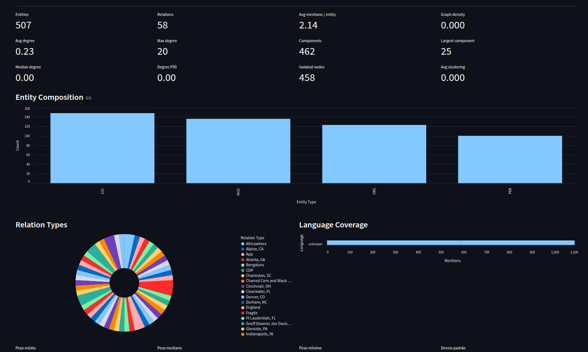
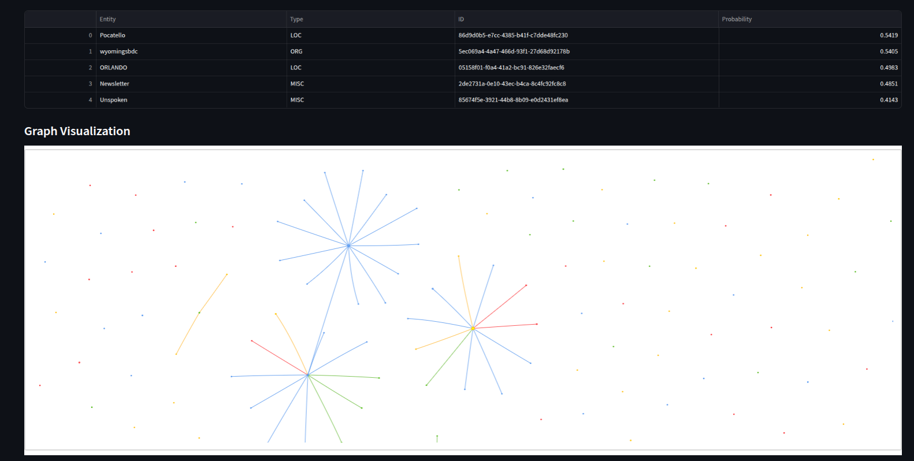

# Translinguistic Geopolitical Knowledge Graph

This project builds a multilingual knowledge graph of geopolitical actors from global news, resolves entities across languages, persists the graph in Neo4j, and trains a Graph Neural Network (GNN) to predict emerging relations. Everything runs inside Docker containers for reproducibility.

## Repository Highlights

- **Translingual NLP** – Hugging Face transformers perform multilingual NER and sentence embeddings for entity resolution.
- **Knowledge Graph Construction** – Entities and relations are persisted in Neo4j with Cypher `MERGE` semantics.
- **Generative Relation Extraction** – A dedicated pipeline wraps the Babelscape REBEL model to harvest subject–predicate–object tripletas directly from article sentences.
- **GNN Link Prediction** – PyTorch Geometric implementa um GraphSAGE para prever links, registrar métricas de treinamento e disponibilizar um playground de inferência no dashboard.
- **Mage Orchestration** – Mage pipelines orchestrate the end-to-end workflow.
- **Containerized Delivery** – `docker-compose` wires Neo4j, Mage, and application services.
- **Interactive Analytics** – A Streamlit dashboard surfaces entity, relation, and language KPIs with live charts.

## Project Layout

```text
├── config/                 # YAML configuration (models, thresholds, graph targets)
├── data/                   # Sample articles for dry runs and tests
├── mage/                   # Mage block stubs and notes
├── scripts/                # CLI entry points for pipeline and training
├── src/                    # Python package with data, NLP, graph, and GNN modules
├── tests/                  # Pytest suites covering core logic
├── Dockerfile              # Image for pipeline + training services
├── docker-compose.yml      # Multi-service orchestration
├── pyproject.toml          # Python project metadata
└── requirements.txt        # Locked dependencies for Docker builds
```

## Configuration

The default configuration lives in `config/pipeline.yaml`. Key sections:

- `data.csv` – Local TSV/CSV source with article URLs, selection limit, and preview output (`artifacts/articles_preview.jsonl`).
- `data.gdelt` – Fallback GDELT definition (`sample_path` for local development or `gkg_url` for live pulls).
- `nlp` – Model names, entity types, similarity thresholds, and relation heuristics.
      - Set `relation_strategy: rebel` to activate the REBEL generative extractor. Tweak nested `rebel` options (model, beams, sentence length) to trade off speed vs. recall; leave as `cooccurrence` to keep the lightweight heuristic.
      - Leave `entity_types` blank to ingest every label emitted by the NER model, or enumerate the tags you care about (for example `entity_types: [PER, ORG, LOC, MISC]` for the CoNLL taxonomy).
- `graph.neo4j` – Bolt URI and credentials for the Neo4j service.
- `gnn` – Dataset location, embedding dimensionality, training hyperparameters, artefact paths, and device.
      - `dataset_path` – Location of the PyG snapshot exported by the pipeline.
      - `metrics_path` – JSON file produced by `scripts/train_gnn.py` with epoch-wise metrics for the dashboard.
      - `model_artifact_path` – Torch checkpoint with encoder + predictor weights for link prediction.

Adjust the file before running the containers to match your credentials and resource limits.

## Running with Docker

1. **Start infrastructure** (Neo4j + Mage UI):

   ```bash
   docker compose up -d neo4j mage
   ```

   - Neo4j Browser: <http://localhost:7474>
   - Mage UI: <http://localhost:6789>

1. **Run the full workflow** (pipeline + GNN training in sequence):

   ```bash
   docker compose run --rm workflow
   ```

   This command runs the extractor, exports the PyG snapshot, trains the GNN, and exits once training is complete.

   To execute the end-to-end workflow *and* keep the Streamlit dashboard running inside the same container, use the `full` profile instead:

   ```bash
   docker compose run --rm --service-ports full
   ```

   The dashboard will be available at <http://localhost:8501> until you stop the container. Logs from the extraction and training stages appear in the same terminal.

1. **Execute the extraction pipeline** (runs NER, entity resolution, Neo4j loading, and PyG export):

   ```bash
   docker compose run --rm pipeline
   ```

1. **Train the GNN** on the exported snapshot:

   ```bash
   docker compose run --rm trainer
   ```

The exported PyG dataset is saved to `artifacts/pyg_graph.pt`. Training metrics are logged to stdout.

1. **Launch the interactive dashboard** (after running the pipeline at least once):

   ```bash
   docker compose up dashboard
   ```

   The Streamlit UI will be available at <http://localhost:8501>. It carrega `artifacts/dashboard_metrics.json` por padrão (com fallback para o snapshot de exemplo) e, quando disponíveis, mostra estatísticas ampliadas do grafo, curvas de treinamento do GNN e um playground de predição de links. A ingestão também salva os corpos dos artigos em `artifacts/articles_preview.jsonl` para inspeção rápida.

   

   

## Mage Integration

- The `mage` service uses the official `mageai/mageai` image.
- Mounts `./mage` into `/home/src`, so Mage blocks can import project modules (`from src...`).
- Suggested block ordering is documented in `mage/README.md`.
- Use Mage to schedule the pipeline or to parameterize runs across locales.

## Local Development

1. Install dependencies:

   ```bash
   python -m venv .venv
   source .venv/bin/activate
   pip install -r requirements.txt
   ```

1. Run the pipeline or training entrypoints directly:

   ```bash
   python scripts/run_pipeline.py --config config/pipeline.yaml
   python scripts/train_gnn.py --config config/pipeline.yaml
   ```

   Or trigger everything at once:

   ```bash
   python scripts/run_workflow.py --config config/pipeline.yaml
   ```

   Add `--launch-dashboard` to open the Streamlit UI automatically after processing, or use the make target `make workflow` for a shorter alias.

   To run the whole pipeline, train the GNN, and launch the dashboard in a single command, use the bundled helper:

   ```bash
   python scripts/run_full_pipeline.py --config config/pipeline.yaml
   ```

   The equivalent Make target is `make full`.

1. Explore analytics locally:

   ```bash
   streamlit run apps/dashboard.py
   ```

1. Execute tests (skips GPU-heavy suites if optional deps are missing):

   ```bash
   pytest
   ```

### Knowledge Triples from URLs

Run the REBEL-powered extractor on one or more article URLs and optionally save the output to disk:

```bash
python scripts/run_rebel_pipeline.py "https://example.com/news" --output artifacts/rebel_triples.json
```

The script downloads each article, segments sentences with spaCy, invokes the REBEL text-to-text generator, and stores every high-confidence (sujeito, relação, objeto) tripleta alongside its originating sentence.

### Visualizar métricas e inferências do GNN

1. Rode o pipeline (`python scripts/run_pipeline.py --config config/pipeline.yaml`) para gerar `artifacts/dashboard_metrics.json` e `artifacts/pyg_graph.pt`.
2. Treine o modelo: `python scripts/train_gnn.py --config config/pipeline.yaml`.
   - O treino gera `artifacts/gnn_training_metrics.json` (histórico por época) e `artifacts/gnn_link_predictor.pt` (pesos do encoder e do preditor).
3. Abra o dashboard com `streamlit run apps/dashboard.py` e explore:
   - **Graph summary**: densidade, graus, percentis, coeficiente de clustering e picos diários de atividade.
   - **GNN Training Metrics**: curvas de AUC/AP e perda, métricas de duração, contagem de parâmetros e configuração utilizada.
   - **GNN Link Prediction Playground**: selecione entidades para estimar a probabilidade de uma nova relação ou receba recomendações de vínculos prováveis.
   - **Sidebar de treino**: ajuste hiperparâmetros (épocas, hidden/out channels, dropout, divisões de validação/teste, caminhos de artefatos) e reexecute o GNN sem sair do dashboard.

## Tests and Quality Gates

| Suite | Target |
|-------|--------|
| `tests/test_config_loader.py` | Configuration parsing |
| `tests/test_entity_resolution.py` | Similarity clustering |
| `tests/test_relation_extraction.py` | Co-occurrence heuristic |
| `tests/test_metrics.py` | Dashboard metric aggregation |
| `tests/test_graph_export.py` | PyG export (auto-skipped if PyG unavailable) |

## Next Steps

- Expand evaluation with temporal splits (Y vs. Y+1) and richer metrics (MRR, Hits@K).
